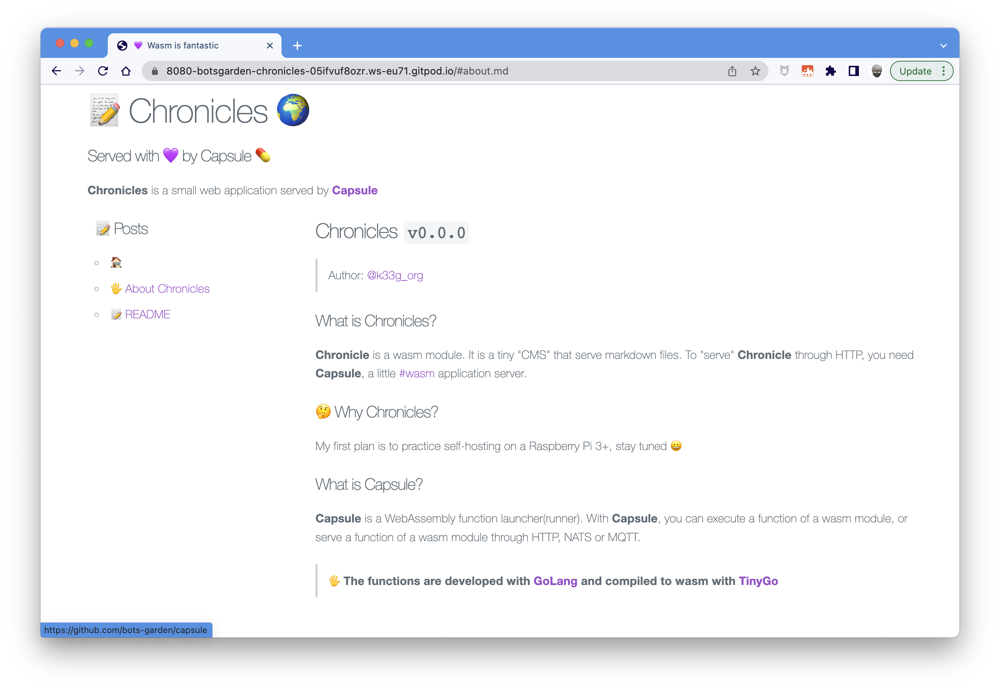

## Chronicles



### Pre-requisites
> Development environment

Install [Capsule Builder](https://github.com/bots-garden/capsule-function-builder):

```bash
CAPSULE_BUILDER_VERSION="v0.0.2"
wget -O - https://raw.githubusercontent.com/bots-garden/capsule-function-builder/${CAPSULE_BUILDER_VERSION}/install-capsule-builder.sh | bash
```

Install [Capsule](https://github.com/bots-garden/capsule)

🖐 You need **Node.js** and **Yarn** or **Npm** to build the Html page

### Build the Single Page Application
> The Html page

#### With Npm

```bash
cd resources
npm install
npm run build
```

#### With Yarn

```bash
cd resources
yarn
yarn run build
```

> - The build SPA is located to `resources/dist/index.html`
> - It will be embedded in the wasm file

### Build the Wasm module

```bash
cabu build ./ index.go index.wasm
```


### Prepare the website

You need at least 4 files:
- `index.wasm` (this is the web application served by **Capsule**)
- `header.md` (this is the header of the website)
- `home.md` (this is the main content)
- `menu.md` (this is the menu of the website with all the links to the other markdown files)

> - You can add every other markdown document
> - To add a link to a new document: use `[text](/#name_of_the_file.md)`
>   - for example: `- [🖐 About Chronicles](/#about.md)`

### Serve the Chronicle website 

```bash
capsule \
-wasm=./index.wasm \
-mode=http \
-httpPort=8080
```

### Serve the Chronicle website with Docker

```bash
docker build -t chronicles . 
docker images | grep chronicles
docker run -p 8080:8080 --rm chronicles
```
